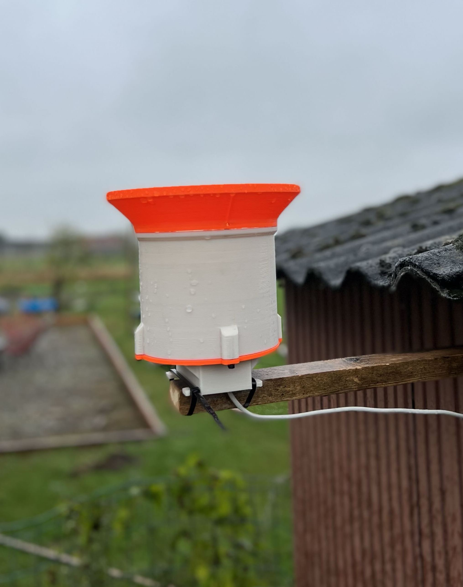

# MicroPython Weather Station

This is a MicroPython-based weather station designed for real-time environmental monitoring. It measures rainfall using a rain gauge and temperature, humidity, pressure, and gas concentration using a BME680 sensor. The data is transmitted via MQTT protocol for efficient monitoring.

## Features

* Rainfall Measurement: Accurately records rainfall data through a rain gauge.
* Environmental Sensing: Measures temperature, humidity, pressure, and gas concentration using a BME680 sensor.
* MQTT Communication: Sends sensor data to an MQTT broker, allowing for real-time data analysis and monitoring.
* Http Server: Provides a simple http server to display the current sensor data and status.
* Watchdog Timer: Ensures continuous operation and recovery from potential failures.

# Hardware Requirements

* MicroPython-compatible board 
  * https://www.raspberrypi.com/products/raspberry-pi-pico/
* Rain Gauge
  * I have 3d printed this one https://www.printables.com/model/130513-rain-gauge
  * you need a reed switch and a magnet to make it work, but this is described in the printables repo
  * you can also buy one, but I haven't tried this 😅
* BME680 Environmental Sensor, a BME280 will also work but has no gas sensor. this will require another library, the `bme680.py` file will need to be updated to use the `bme280.py` library instead. _this is not included in this repo_
  * https://www.adafruit.com/product/3660
* Necessary wiring and power supply

# Software Dependencies

* MicroPython firmware on the rapsberry pico w
  * How to -> https://www.raspberrypi.com/documentation/microcontrollers/micropython.html
* BME680 library for MicroPython. This is included in the repository, see `bme680.py`
* MQTT client library for MicroPython (`umqtt.simple`)

# Wiring

The way you wire everything is not super important. you have 2 connections that need to be made.
1. the reed contact needs to be connected to a pin that can be used as an interrupt. I used pin `28` on my pico, but you can use any pin that supports interrupts.
2. the BME680 sensor needs to be connected to the I2C bus. on the pico this is pin `16` and `17`. you can use any I2C bus on your board, but you will need to update the `settings.py` file to use the correct bus.
the included BME680 lib is from https://github.com/robert-hh/BME680-Micropython

# Installation

* Flash your MicroPython board with the latest MicroPython firmware.
* I used PyCharm with the micropython plugin to upload the files to the board. you can use any method you like.
* Connect the BME680 sensor and rain gauge to the board.
* Install the BME680 and MQTT client libraries on your board.

# Configuration

* Update the `config.py` file with your WiFi and MQTT broker details.
* Adjust the pin configuration if your setup differs from the default.

# Usage

The main.py file is the entry point of the application. On startup, the device connects to the specified WiFi network and MQTT broker. The WeatherStation class handles sensor data collection and sends it to the WeatherStationListener. Data is published to the MQTT broker at regular intervals set by a timer. The device's LED blinks during setup and when attempting to connect to WiFi.

# Contributing

Contributions are welcome. Please fork this repository, make your changes, and submit a pull request.

